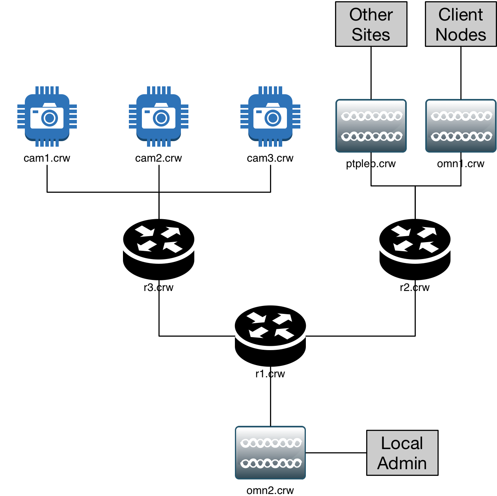

.. sectnum::

===============================================================================================
Safety and Engineering Binder for HamWAN Memphis Metro Installation at the Craft Rd Water Tower
===============================================================================================
:Copyright: 2017 with a Creative Commons Attribution 4.0 International (CC BY 4.0) license
:Authors: Turner, Ryan
:Revision: 1
:Date: 21 April 2017
:Organization: HamWAN Memphis Metro, Inc
:Contact: netops@memhamwan.org

.. raw:: pdf

   PageBreak

.. contents:: Table of Contents

.. attention:: For service or support, contact HamWAN NOC at netops@memhamwan.org

.. raw:: pdf

   PageBreak

Introduction
============
This document exists to provide on-site reference materials about the equipment installed on premesis, especially for troubleshooting and incident response purposes. It is not meant to be a complete record of every device installed. The source of this is maintained on the HamWAN Deployment Engineering repository, and discussion of its content may be facilitated there.

Safety Warnings
---------------

.. WARNING:: **Radio Frequency Fields on top of the tank exceed the FCC general public exposure limit.**
  Obey all posted signs and site guidelines for working in radio frequency environments. Contact HamWAN NOC at netops@memhamwan.org prior to approaching any microwave antenna on this site. In accordance with Federal Communications Commission rules on radio frequency emissions 47 CFR 1.1307(b)

Systems Design and Deployment
=============================

Physical Devices (Layer 1)
--------------------------

.. csv-table:: Site Assets
   :file: crw-assets.csv
   :header-rows: 1

Network Hosts (Layer 3)
-----------------------

.. csv-table:: Addressing
   :file: crw-ip-addresses.csv
   :widths: 40,40,20
   :header-rows: 1

Cabling Subsystem Link Record
-----------------------------

The premesis is considered a Class 1 TIA-606-B space. All physical telecommunications infrastructure is arranged such that it is TIA-606-B standards compliant [#]_.

.. csv-table:: Infrastructure Identifiers
   :file: crw-identifiers.csv
   :widths: 20,20,60
   :header-rows: 1

.. csv-table:: Cabling Subsystem Link Record
   :file: cabling_subsystem_link_record.csv
   :header-rows: 1

Signal Survey
-------------
Work in progress...

* *omn1.crw* on 5920 MHz (10 MHz channel width) at or below 30 dBm (RB912UAG-5HPnD) into a 13 dBi gain omni antenna (AMO-5G13)
* *omn2.crw* on (20 MHz channel width)
* *ptpleb.crw* on (20 MHz channel width)

Licensing and Permitting
========================

RF Spectrum
-----------
All transmitters at this location are operating using the FCC license below or within the U-NII FCC regulatory domain.

.. figure:: KM4ECM-FCC-License.png
  :alt: KM4ECM FCC License

  MemHamWAN's KM4ECM amateur radio license with club privileges.

.. [#] `Administration Standard for Telecommunications Infrastructure TIA-606-B <http://az776130.vo.msecnd.net/media/docs/default-source/contractors-and-bidders-library/standards-guidelines/it-standards/tia-606-b.pdf?sfvrsn=2>`_
.. footer::
  ###Page###
