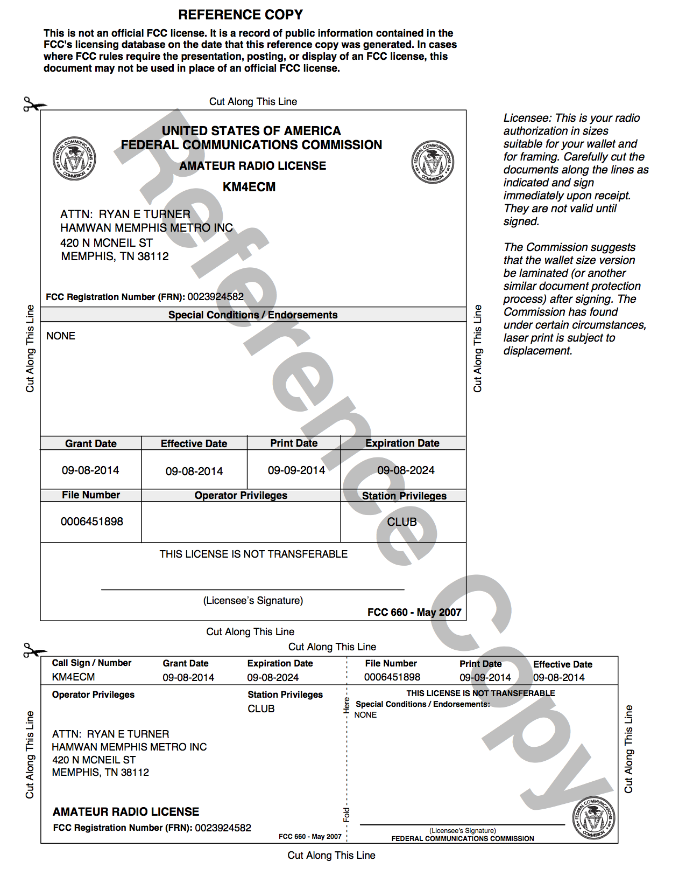

.. sectnum::

Safety and Engineering Binder for HamWAN Memphis Metro Installation at the Craft Rd Water Tower
===============================================================================================
:Copyright: 2017 with a Creative Commons Attribution 4.0 International (CC BY 4.0) license
:Authors: Turner, Ryan
:Revision: 2
:Date: 17 April 2017
:Organization: HamWAN Memphis Metro, Inc
:Contact: netops@memhamwan.org

.. raw:: pdf

   PageBreak

.. contents:: Table of Contents

.. raw:: pdf

   PageBreak

Safety Warnings
===============

.. WARNING:: **Radio Frequency Fields on top of the tank exceed the FCC general public exposure limit.**
  Obey all posted signs and site guidelines for working in radio frequency environments. Contact HamWAN NOC at netops@memhamwan.org prior to approaching any microwave antenna on this site. In accordance with Federal Communications Commission rules on radio frequency emissions 47 CFR 1.1307(b)

Systems Overview
================
TODO

Cabling Subsystem Link Record
=============================

.. csv-table:: Cabling Subsystem Link Record
   :file: cabling_subsystem_link_record.csv
   :header-rows: 1

Licensing and Permitting
========================

RF Spectrum
-----------
All transmitters at this location are operating using the FCC license below or within the U-NII FCC regulatory domain.

  MemHamWAN's KM4ECM amateur radio license with club privileges.

Signal Survey
=============
TODO
