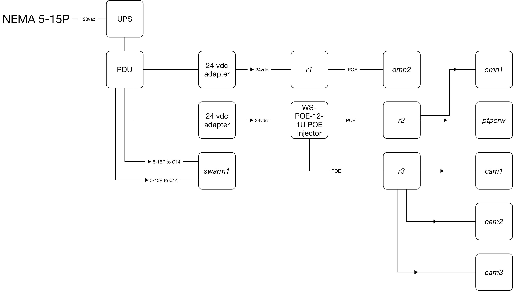

.. sectnum::

===============================================================================================
Safety and Engineering Binder for HamWAN Memphis Metro Installation at the Craft Rd Water Tower
===============================================================================================
:Copyright: 2017 with a Creative Commons Attribution 4.0 International (CC BY 4.0) license
:Authors: Turner, Ryan
:Revision: 1
:Date: 21 April 2017
:Organization: HamWAN Memphis Metro, Inc
:Contact: netops@memhamwan.org

.. raw:: pdf

   PageBreak

.. contents:: Table of Contents

.. attention:: For service or support, contact HamWAN NOC at netops@memhamwan.org

.. raw:: pdf

   PageBreak

Introduction
============
This document exists to provide on-site reference materials about the equipment installed on premesis, especially for troubleshooting and incident response purposes. It is not meant to be a complete record of every device installed. The source of this is maintained on the HamWAN Deployment Engineering repository, and discussion of its content may be facilitated there.

Safety Warnings
---------------

.. WARNING:: **Radio Frequency Fields on top of the tank exceed the FCC general public exposure limit.**
  Obey all posted signs and site guidelines for working in radio frequency environments. Contact HamWAN NOC at netops@memhamwan.org prior to approaching any microwave antenna on this site. In accordance with Federal Communications Commission rules on radio frequency emissions 47 CFR 1.1307(b)

Systems Design and Deployment
=============================

Physical Devices (Layer 1)
--------------------------

.. figure:: network-diagram-layer1.png
  :alt: Layer 1 network diagram

  Layer 1 network diagram

  Power block diagram

.. csv-table:: Site Assets
   :header-rows: 1

   Make,Model,Serial #,Asset Tag
   MikroTik,uAP ac,711F062B5DBB,10016
   MikroTik,RB750P-PBr2,,10017
   MikroTik,RB750P-PBr2,,10018
   MikroTik,RB3011UiAS-RM,780F064B04AB,10019
   MikroTik,RB911G-5HPacD-NB,,10020
   MikroTik,RB921UAGS-5SHPacT-NM,,10021
   APC,PDU,,10022
   HP,DL360 G6,,10023

Network Hosts (Layer 3)
-----------------------

.. csv-table:: Addressing
   :widths: 40,40,20
   :header-rows: 1

   Hostname,Alias,IP
   cam1.crw.memhamwan.net,eth0.cam1.crw.memhamwan.net,44.34.129.121/28
   cam2.crw.memhamwan.net,eth0.cam2.crw.memhamwan.net,44.34.129.122/28
   cam3.crw.memhamwan.net,eth0.cam3.crw.memhamwan.net,44.34.129.123/28
   cam4.crw.memhamwan.net,eth0.cam4.crw.memhamwan.net,44.34.129.124/28
   omn1.crw.memhamwan.net,ether1.omn1.crw.memhamwan.net,44.34.129.114/28
   ,wlan1.omn1.crw.memhamwan.net,44.34.129.129/28
   omn2.crw.memhamwan.net,ether1.omn2.crw.memhamwan.net,44.34.129.119/28
   ptpleb.crw.memhamwan.net,ether1.ptpleb.crw.memhamwan.net,44.34.129.115/28
   ,wlan1.ptpleb.crw.memhamwan.net,44.34.131.144/28
   r1.crw.memhamwan.net,ether1.r1.crw.memhamwan.net,44.34.129.116/28
   r2.crw.memhamwan.net,ether1.r2.crw.memhamwan.net,44.34.129.117/28
   r3.crw.memhamwan.net,ether1.r3.crw.memhamwan.net,44.34.129.118/28

Cabling and Housing Subsystem
-----------------------------

The premesis is considered a Class 1 TIA-606-B space. All physical telecommunications infrastructure is arranged such that it is TIA-606-B standards compliant [#]_.

.. csv-table:: Infrastructure Identifiers
   :widths: 20,20,60
   :header-rows: 1

   Identifier,Type,Description
   +2HW,TS Identifier,The 2nd level of the water tower in HamWAN's area
   +WT,TS Identifier,The top of the water tower
   +2HW.1,Cabinet Identifier,The first cabinet in the HamWAN area
   +WT.1,Cabinet Identifier,The first mast on top of the water tower

.. csv-table:: Cabling Subsystem Link Record
   :header-rows: 1
   :widths: 20,20,10,30

   Link ID,Cable Type,Cable Length,Service Record
   2HW01-42:01/PHHW01-1:01,ARCFLEX FLEX6Cable,,
   +2HW.1-SWARM1:ETH0/+2HW.1-R1:8,Vericom Verimax MBW6U-01444,,
   +2HW.1-SWARM1:ETH1/+2HW.1-R1:9,Vericom Verimax MBW6U-01444,,
   +2HW.1-SWARM1:ILO/+2HW.1-R1:7,Vericom Verimax MBW6U-01444,,

.. csv-table:: Cabinet +2HW.1
  :header-rows: 1
  :widths: 5,22,25,23,25

  #,Front Device ID,Front Device Description,Back Device ID,Back Device Description
  42,,Cover,+2HW.1-42,Patch Panel
  41,,Cover,+2HW.1-poe,WS-POE-12-1U POE Injector
  40,,Cover,,Cable Manager
  39,,Cover,,Cable Manager
  38,,Cover,+2HW.1-r1,RB3011
  37,,Cover,,Cable Manager
  36,,Cover,+2HW.1-pdu,APC PDU
  35,,Cover,,
  34,,Cover,,
  33,,Cover,,
  32,,Cover,,
  31,,Cover,,
  30,,Cover,,
  29,,Cover,,
  28,,Cover,,
  27,,Cover,,
  26,+2HW.1-swarm1,HP DL360,+2HW.1-swarm1,HP DL360
  25,,
  24,,
  23,,
  22,,
  21,,
  20,,
  19,,
  18,,
  17,,
  16,,
  15,,
  14,,
  13,,
  12,,
  11,,
  10,,
  09,,
  08,,
  07,,
  06,,
  05,,
  04,,
  03,,
  02,,
  01,,

Signal Survey
-------------
Work in progress...

* *omn1.crw* on 5920 MHz (10 MHz channel width) at or below 30 dBm (RB912UAG-5HPnD) into a 13 dBi gain omni antenna (AMO-5G13)
* *omn2.crw* on (20 MHz channel width)
* *ptpleb.crw* on (20 MHz channel width)

Licensing and Permitting
========================

RF Spectrum
-----------
All transmitters at this location are operating using the FCC license below or within the U-NII FCC regulatory domain.

.. figure:: KM4ECM-FCC-License.png
  :alt: KM4ECM FCC License

  MemHamWAN's KM4ECM amateur radio license with club privileges.

.. [#] `Administration Standard for Telecommunications Infrastructure TIA-606-B <http://az776130.vo.msecnd.net/media/docs/default-source/contractors-and-bidders-library/standards-guidelines/it-standards/tia-606-b.pdf?sfvrsn=2>`_
.. footer::
  ###Page###
