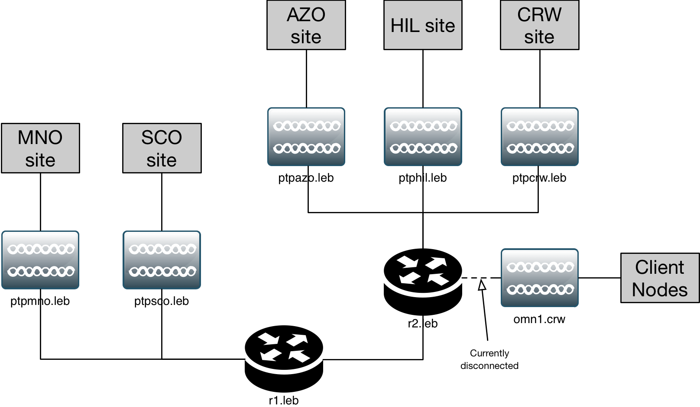

.. sectnum::

========================================================================================================
Safety and Engineering Binder for HamWAN Memphis Metro Installation at the LeBonheur Children's Hospital
========================================================================================================
:Copyright: 2017 with a Creative Commons Attribution 4.0 International (CC BY 4.0) license
:Authors: Turner, Ryan
:Revision: 1
:Date: 21 April 2017
:Organization: HamWAN Memphis Metro, Inc
:Contact: netops@memhamwan.org

.. raw:: pdf

   PageBreak

.. contents:: Table of Contents

.. attention:: For service or support, contact HamWAN NOC at netops@memhamwan.org

.. raw:: pdf

   PageBreak

Introduction
============
This document exists to provide on-site reference materials about the equipment installed on premesis, especially for troubleshooting and incident response purposes. It is not meant to be a complete record of every device installed. The source of this is maintained on the HamWAN Deployment Engineering repository, and discussion of its content may be facilitated there.

Safety Warnings
---------------

.. WARNING:: **Radio Frequency Fields on roof above the elevator room exceed the FCC general public exposure limit.**
  Obey all posted signs and site guidelines for working in radio frequency environments. Contact HamWAN NOC at netops@memhamwan.org prior to approaching any microwave antenna on this site. In accordance with Federal Communications Commission rules on radio frequency emissions 47 CFR 1.1307(b)

Systems Design and Deployment
=============================

Physical Devices (Layer 1)
--------------------------

  Layer 1 network diagram
  
.. csv-table:: Site Assets
   :header-rows: 1

   Make,Model,Serial #,Asset Tag
   ,,,

Network Hosts (Layer 3)
-----------------------

.. csv-table:: Addressing
      :widths: 40,40,20
      :header-rows: 1

      Hostname,Alias,IP
      allstar.leb.memhamwan.net,eth0.allstar.leb.memhamwan.net,44.34.128.166
      allstar-dmr.leb.memhamwan.net,eth0.allstar-dmr.leb.memhamwan.net,44.34.128.185/27
      dmr.leb.memhamwan.net,eth0.dmr.leb.memhamwan.net,44.34.128.186/27
      dstar.leb.memhamwan.net,eth0.dstar.leb.memhamwan.net,44.34.128.167/27
      esxi1.leb.memhamwan.net,eth0.esxi1.leb.memhamwan.net,44.34.128.164/27
      nas1.leb.memhamwan.net,eth0.nas1.leb.memhamwan.net,44.34.128.188/27
      ,eth1.nas1.leb.memhamwan.net,44.34.128.189/27
      ,ilo.nas1.leb.memhamwan.net,44.34.128.190/27
      ns1.leb.memhamwan.net,eth0.ns1.leb.memhamwan.net,44.34.128.165/27
      nvr.leb.memhamwan.net,eth0.nvr.leb.memhamwan.net,44.34.128.179/27
      omn1.leb.memhamwan.net,ether1.omn1.leb.memhamwan.net,44.34.128.183/27
      ,wlan1.omn1.leb.memhamwan.net,44.34.128.209/27
      ptpazo.leb.memhamwan.net,ether1.ptpazo.leb.memhamwan.net,44.34.128.184/27
      ,wlan1.ptpazo.leb.memhamwan.net,44.34.131.142/32
      ptpcrw.leb.memhamwan.net,ether1.ptpcrw.leb.memhamwan.net,44.34.128.168/27
      ,wlan1.ptpcrw.leb.memhamwan.net,44.34.131.145/32
      ptphil.leb.memhamwan.net,ether1.ptphil.leb.memhamwan.net,44.34.128.182/27
      ,wlan1.ptphil.leb.memhamwan.net,44.34.131.130/32
      ptpmno.leb.memhamwan.net,ether1.ptpmno.leb.memhamwan.net,44.34.128.187/27
      ,wlan1.ptpmno.leb.memhamwan.net,44.34.131.141/32
      ptpsco.leb.memhamwan.net,ether1.ptpsco.leb.memhamwan.net,44.34.128.163/27
      ,wlan0.ptpsco.leb.memhamwan.net,44.34.131.132/32
      r1.leb.memhamwan.net,ether1.r1.leb.memhamwan.net,44.34.128.161/27
      ,sstp1.r1.leb.memhamwan.net,44.34.130.8/27
      stream.leb.memhamwan.net,eth0.stream.leb.memhamwan.net,44.34.128.178/27
      voip.leb.memhamwan.net,eth0.voip.leb.memhamwan.net,44.34.128.173/27
      vrrp.leb.memhamwan.net,vrrp.vrrp.leb.memhamwan.net,44.34.128.174/27

Cabling and Housing Subsystem
-----------------------------

The premesis is considered a Class 1 TIA-606-B space. All physical telecommunications infrastructure is arranged such that it is TIA-606-B standards compliant [#]_.

.. csv-table:: Infrastructure Identifiers
   :widths: 20,20,60
   :header-rows: 1

   Identifier,Type,Description
   ,,

.. csv-table:: Cabling Subsystem Link Record
  :header-rows: 1
  :widths: 20,20,10,30

  Link ID,Cable Type,Cable Length,Service Record
  ,,,

.. csv-table:: Cabinet
  :header-rows: 1
  :widths: 5,22,25,23,25

  #,Front Device ID,Front Device Description,Back Device ID,Back Device Description
  ,,,,

Spectrum Plan
-------------
Work in progress...

* *ptphil.leb* 5200 MHz 20/40mhz-eC
* *ptpmno.leb* 5230 MHz 20/40mhz-eC
* *ptpcrw.leb* 5765 MHz 20/40mhz-eC
* *ptpazo.leb* 5795 MHz 20/40mhz-eC
* *ptpsco.leb* 5825 MHz 20mhz

Licensing and Permitting
========================

RF Spectrum
-----------
All transmitters at this location are operating using the FCC license below or within the U-NII FCC regulatory domain.

.. figure:: KM4ECM-FCC-License.png
  :alt: KM4ECM FCC License

  MemHamWAN's KM4ECM amateur radio license with club privileges.

.. [#] `Administration Standard for Telecommunications Infrastructure TIA-606-B <http://az776130.vo.msecnd.net/media/docs/default-source/contractors-and-bidders-library/standards-guidelines/it-standards/tia-606-b.pdf?sfvrsn=2>`_
.. footer::
  ###Page###
